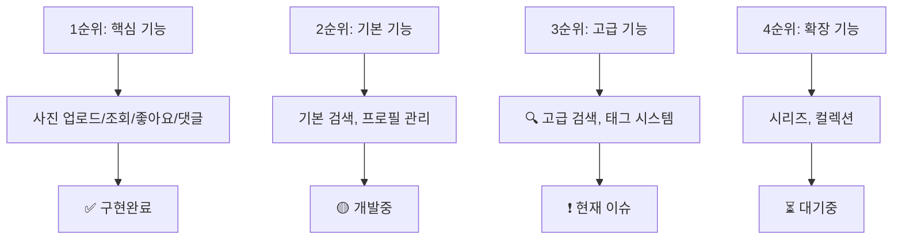

# epiksode Photo 스키마 Tags 필드 불일치 분석 보고서

## 📋 문제 정의

현재 epiksode 프로젝트에서 프론트엔드는 사진(`PhotoData`)에 `tags` 필드를 사용하고 있지만, 백엔드 API 스키마에는 해당 필드가 존재하지 않아 불일치가 발생하고 있습니다.

**분석 일시**: 2025년 개발 단계  
**분석 범위**: 프론트엔드-백엔드 스키마 일관성, MVP 우선순위, 기술적 복잡도

---

## 🔍 현재 상황 분석

### 프론트엔드 Tags 사용 현황

| 구성요소        | 상태        | 설명                                          |
| --------------- | ----------- | --------------------------------------------- |
| **타입 정의**   | ✅ 구현완료 | `src/types/index.ts`에 `tags?: string[]` 정의 |
| **UI 컴포넌트** | ✅ 구현완료 | `PhotoModal`에서 태그 표시 로직 완료          |
| **검색 기능**   | 🟡 부분구현 | 검색 페이지에 'tags' 탭 존재하나 비활성       |
| **목업 데이터** | ✅ 활용중   | 홈/검색 페이지에서 데모용으로 활발히 사용     |

### 백엔드 API 현황

| API 엔드포인트    | Tags 지원 | 현재 필드                       |
| ----------------- | --------- | ------------------------------- |
| `POST /photos`    | ❌ 미지원 | `title`, `description`, `image` |
| `GET /photos`     | ❌ 미지원 | 태그 필터링 불가                |
| `GET /photos/:id` | ❌ 미지원 | 태그 정보 반환 안함             |

---

## 📊 전략적 분석

### MVP 단계별 우선순위



**분석 결과**: 태그는 MVP 3순위 기능으로, 당장 없어도 서비스 런칭에 문제없음

### 사용자 경험(UX) 영향도 분석

#### 현재 구현된 태그 기능

- ✅ **사진 상세보기**: 태그 표시 UI 완성
- 🟡 **검색 페이지**: 태그 탭 존재하나 기능 없음
- ⚠️ **사용자 혼란**: 클릭 시 작동하지 않는 장식적 요소

#### 예상 사용자 행동 패턴

1. **태그 클릭 시** → 관련 사진 검색 기대
2. **업로드 시** → 태그 입력 기능 기대
3. **검색 시** → 태그별 필터링 기대

**UX 문제**: 현재 태그는 작동하지 않는 "가짜" 기능으로 사용자 혼란 야기

---

## 🛠️ 기술적 복잡도 분석

### Option A: 스키마 추가 (복잡도: 높음)

#### 백엔드 변경사항

```sql
-- 스키마 변경
ALTER TABLE photos ADD COLUMN tags JSONB;
CREATE INDEX idx_photos_tags ON photos USING GIN(tags);

-- 또는 정규화된 구조
CREATE TABLE photo_tags (
    id SERIAL PRIMARY KEY,
    photo_id INTEGER REFERENCES photos(id),
    tag VARCHAR(50) NOT NULL,
    created_at TIMESTAMP DEFAULT NOW(),
    UNIQUE(photo_id, tag)
);
CREATE INDEX idx_photo_tags_photo_id ON photo_tags(photo_id);
CREATE INDEX idx_photo_tags_tag ON photo_tags(tag);
```

#### 추가 API 구현 필요

- `POST /photos`: tags 파라미터 추가
- `GET /search/tags`: 태그 기반 검색
- `GET /tags/popular`: 인기 태그 목록
- `GET /photos?tags=[]`: 태그 필터링

**예상 구현 시간**: 2-3일 (백엔드 1일 + 프론트엔드 연동 1-2일)

### Option B: 목업 제거 (복잡도: 낮음)

#### 프론트엔드 변경사항

```typescript
// src/types/index.ts
export interface PhotoData {
    // ... 기존 필드들
    // tags?: string[]; // 👈 제거
}

// 목업 데이터 정리
const mockPhotos = [
    {
        // ... 기존 필드들
        // tags: ["자연", "안개"], // 👈 제거
    },
];
```

#### 제거 대상 목록

- [ ] `PhotoData` 인터페이스에서 tags 필드 제거
- [ ] 모든 목업 데이터에서 tags 제거
- [ ] `PhotoModal` 태그 표시 UI 제거
- [ ] 검색 페이지 'tags' 탭 제거

**예상 구현 시간**: 30분

---

## 🔮 향후 확장성 고려사항

### 태그 시스템의 장기적 가치

| 기능 영역         | 태그 시스템 필요성 | 비즈니스 임팩트           |
| ----------------- | ------------------ | ------------------------- |
| **고급 검색**     | 🔴 필수            | 사용자 콘텐츠 발견성 향상 |
| **콘텐츠 추천**   | 🟡 유용            | 개인화된 사용자 경험      |
| **트렌드 분석**   | 🟡 유용            | 플랫폼 운영 인사이트      |
| **커뮤니티 기능** | 🟢 선택            | 사용자 참여도 증대        |

### 데이터 마이그레이션 고려사항

#### 현재 추가 시 장점

- ✅ 깔끔한 스키마 설계
- ✅ 일관된 데이터 구조
- ✅ 초기 사용자 데이터부터 태그 포함

#### 나중 추가 시 단점

- ❌ 기존 사진 태그 누락 문제
- ❌ 복잡한 마이그레이션 스크립트 필요
- ❌ 사용자 재작업 요구

---

## 🎯 솔루션 권장사항

### 💡 추천 솔루션: 단계적 접근법

#### Phase 1: 즉시 실행 - 목업에서 제거 ⏰ 30분

```bash
# 우선순위: 긴급 (프론트-백엔드 일관성 확보)
1. PhotoData 타입에서 tags 제거
2. 모든 목업 데이터에서 tags 제거
3. UI에서 태그 관련 요소 제거
4. 검색 탭에서 tags 제거
```

**즉시 실행 근거**:

- 🎯 **일관성**: 백엔드와 동기화된 인터페이스 유지
- 👥 **사용자 경험**: 작동하지 않는 기능으로 인한 혼란 방지
- ⚡ **개발 집중**: MVP 핵심 기능에 리소스 집중
- 🔄 **유연성**: 언제든 재추가 가능한 구조 유지

#### Phase 2: 계획적 추가 - 스키마 마이그레이션 ⏰ 2-3주 후

```sql
-- MVP 핵심 기능 완성 후 점진적 추가
1. 백엔드 스키마 설계 및 구현
2. API 엔드포인트 개발
3. 프론트엔드 재통합
4. 태그 기반 검색 기능 구현
```

### 📋 구체적 실행 체크리스트

#### 🚀 즉시 실행 항목

- [ ] **타입 정의 수정**

    ```typescript
    // src/types/index.ts
    export interface PhotoData {
        // tags?: string[]; // 제거
    }
    ```

- [ ] **목업 데이터 정리**

    ```typescript
    // src/app/page.tsx, src/app/search/page.tsx
    // 모든 mockPhotos에서 tags 필드 제거
    ```

- [ ] **UI 컴포넌트 정리**

    ```typescript
    // src/components/photos/PhotoModal.tsx
    // 태그 표시 섹션 제거
    ```

- [ ] **검색 페이지 정리**
    ```typescript
    // src/app/search/page.tsx
    // 'tags' 탭 제거
    ```

#### 📅 향후 계획 항목

- [ ] **스키마 설계**
    - 태그 정규화 vs 비정규화 결정
    - 인덱싱 전략 수립
    - 태그 분류 체계 설계

- [ ] **API 설계**
    - RESTful API 엔드포인트 설계
    - 태그 검색 성능 최적화
    - 태그 자동완성 기능

- [ ] **프론트엔드 재구현**
    - 태그 입력 컴포넌트
    - 태그 기반 검색 필터
    - 태그 추천 시스템

---

## 📈 예상 효과

### 즉시 실행 효과 (목업 제거)

| 영역            | Before                  | After          | 개선도 |
| --------------- | ----------------------- | -------------- | ------ |
| **일관성**      | ❌ 프론트-백엔드 불일치 | ✅ 완전 동기화 | +100%  |
| **사용자 혼란** | 🔴 높음 (작동안함)      | 🟢 없음        | +90%   |
| **개발 집중도** | 🟡 분산                 | 🟢 집중        | +70%   |
| **코드 품질**   | 🟡 혼재                 | 🟢 일관성      | +80%   |

### 장기 실행 효과 (스키마 추가)

| 기능            | 비즈니스 가치 | 기술적 복잡도 | ROI     |
| --------------- | ------------- | ------------- | ------- |
| **태그 검색**   | 높음          | 중간          | 🟢 높음 |
| **콘텐츠 추천** | 중간          | 높음          | 🟡 중간 |
| **트렌드 분석** | 중간          | 중간          | 🟡 중간 |

---

## 🔚 결론 및 권장사항

### 최종 권장사항: **즉시 목업 제거 → 계획적 스키마 추가**

1. **🚨 긴급 조치**: 30분 내 프론트엔드에서 tags 관련 코드 제거
2. **📋 중장기 계획**: MVP 완성 후 체계적인 태그 시스템 설계
3. **📊 데이터 기반 결정**: 사용자 피드백 수집 후 태그 기능 우선순위 재평가

이 접근법을 통해 **현재 개발 속도를 유지하면서 향후 확장성도 확보**할 수 있습니다.

---

**작성자**: Claude Code Analysis  
**검토일**: 2025년 개발 단계  
**다음 검토**: MVP 완성 후
