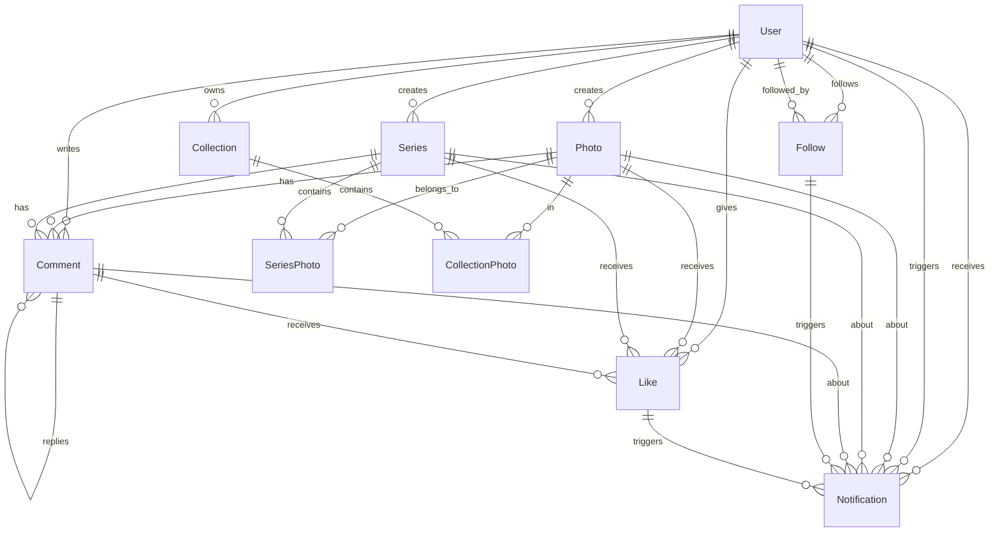

# 📊 데이터베이스 스키마 문서

**대상**: 프론트엔드 개발팀  
**작성일**: 2025년 8월 10일  
**목적**: 정확한 TypeScript 인터페이스 생성 및 API 데이터 구조 이해  
**데이터베이스**: PostgreSQL + Prisma ORM

---

## 🎯 **핵심 엔티티 관계도 (ERD)**



---

## 📋 **테이블별 상세 스키마**

### 👥 **Users 테이블**

| 컬럼명              | 타입           | 제약사항                      | 기본값  | 설명                   |
| ------------------- | -------------- | ----------------------------- | ------- | ---------------------- |
| `id`                | `INTEGER`      | `PRIMARY KEY, AUTO_INCREMENT` | -       | 사용자 고유 ID         |
| `email`             | `VARCHAR(255)` | `UNIQUE, NOT NULL`            | -       | 이메일 주소            |
| `password_hash`     | `VARCHAR(255)` | `NOT NULL`                    | -       | bcrypt 해시된 패스워드 |
| `username`          | `VARCHAR(50)`  | `NOT NULL`                    | -       | 사용자명 (화면 표시용) |
| `bio`               | `TEXT`         | `NULLABLE`                    | `null`  | 자기소개               |
| `profile_image_url` | `TEXT`         | `NULLABLE`                    | `null`  | 프로필 이미지 URL      |
| `notify_likes`      | `BOOLEAN`      | `NOT NULL`                    | `true`  | 좋아요 알림 수신 여부  |
| `notify_comments`   | `BOOLEAN`      | `NOT NULL`                    | `true`  | 댓글 알림 수신 여부    |
| `notify_follows`    | `BOOLEAN`      | `NOT NULL`                    | `true`  | 팔로우 알림 수신 여부  |
| `notify_series`     | `BOOLEAN`      | `NOT NULL`                    | `true`  | 시리즈 알림 수신 여부  |
| `created_at`        | `TIMESTAMP`    | `NOT NULL`                    | `NOW()` | 계정 생성일시          |
| `updated_at`        | `TIMESTAMP`    | `NOT NULL`                    | `NOW()` | 마지막 수정일시        |
| `deleted_at`        | `TIMESTAMP`    | `NULLABLE`                    | `null`  | 소프트 삭제 일시       |

**중요 사항**:

- ✅ **ID는 정수형 AUTO_INCREMENT** (문자열 ID 아님)
- ✅ **패스워드는 평문 저장 안함** (bcrypt 해시만)
- ✅ **소프트 삭제** 지원 (`deleted_at` 필드)

### 📸 **Photos 테이블**

| 컬럼명          | 타입           | 제약사항                      | 기본값       | 설명              |
| --------------- | -------------- | ----------------------------- | ------------ | ----------------- |
| `id`            | `INTEGER`      | `PRIMARY KEY, AUTO_INCREMENT` | -            | 사진 고유 ID      |
| `user_id`       | `INTEGER`      | `FOREIGN KEY → users(id)`     | -            | 작성자 ID         |
| `title`         | `VARCHAR(255)` | `NOT NULL`                    | `'Untitled'` | 사진 제목         |
| `description`   | `TEXT`         | `NULLABLE`                    | `null`       | 사진 설명         |
| `image_url`     | `TEXT`         | `NOT NULL`                    | -            | 원본 이미지 URL   |
| `thumbnail_url` | `TEXT`         | `NOT NULL`                    | -            | 썸네일 이미지 URL |
| `view_count`    | `INTEGER`      | `NOT NULL`                    | `0`          | 조회수            |
| `is_public`     | `BOOLEAN`      | `NOT NULL`                    | `true`       | 공개/비공개 설정  |
| `created_at`    | `TIMESTAMP`    | `NOT NULL`                    | `NOW()`      | 업로드 일시       |
| `updated_at`    | `TIMESTAMP`    | `NOT NULL`                    | `NOW()`      | 수정 일시         |
| `deleted_at`    | `TIMESTAMP`    | `NULLABLE`                    | `null`       | 소프트 삭제 일시  |

**인덱스**:

- `user_id` (작성자별 사진 조회 최적화)
- `created_at` (최신순 정렬 최적화)

### 💬 **Comments 테이블** (다형성 구조)

| 컬럼명       | 타입        | 제약사항                               | 기본값  | 설명                       |
| ------------ | ----------- | -------------------------------------- | ------- | -------------------------- |
| `id`         | `INTEGER`   | `PRIMARY KEY, AUTO_INCREMENT`          | -       | 댓글 고유 ID               |
| `user_id`    | `INTEGER`   | `FOREIGN KEY → users(id)`              | -       | 작성자 ID                  |
| `content`    | `TEXT`      | `NOT NULL`                             | -       | 댓글 내용                  |
| `photo_id`   | `INTEGER`   | `FOREIGN KEY → photos(id), NULLABLE`   | `null`  | 사진 댓글인 경우           |
| `series_id`  | `INTEGER`   | `FOREIGN KEY → series(id), NULLABLE`   | `null`  | 시리즈 댓글인 경우         |
| `parent_id`  | `INTEGER`   | `FOREIGN KEY → comments(id), NULLABLE` | `null`  | 대댓글인 경우 부모 댓글 ID |
| `created_at` | `TIMESTAMP` | `NOT NULL`                             | `NOW()` | 작성 일시                  |
| `updated_at` | `TIMESTAMP` | `NOT NULL`                             | `NOW()` | 수정 일시                  |
| `deleted_at` | `TIMESTAMP` | `NULLABLE`                             | `null`  | 소프트 삭제 일시           |

**중요 사항**:

- ✅ **다형성 관계**: `photo_id` 또는 `series_id` 중 하나만 값을 가짐
- ✅ **대댓글 지원**: `parent_id`로 계층 구조 표현
- ✅ **인덱스**: `photo_id`, `series_id`, `user_id`

### ❤️ **Likes 테이블** (다형성 구조)

| 컬럼명       | 타입        | 제약사항                               | 기본값  | 설명                  |
| ------------ | ----------- | -------------------------------------- | ------- | --------------------- |
| `id`         | `INTEGER`   | `PRIMARY KEY, AUTO_INCREMENT`          | -       | 좋아요 고유 ID        |
| `user_id`    | `INTEGER`   | `FOREIGN KEY → users(id)`              | -       | 좋아요 누른 사용자 ID |
| `photo_id`   | `INTEGER`   | `FOREIGN KEY → photos(id), NULLABLE`   | `null`  | 사진 좋아요인 경우    |
| `series_id`  | `INTEGER`   | `FOREIGN KEY → series(id), NULLABLE`   | `null`  | 시리즈 좋아요인 경우  |
| `comment_id` | `INTEGER`   | `FOREIGN KEY → comments(id), NULLABLE` | `null`  | 댓글 좋아요인 경우    |
| `created_at` | `TIMESTAMP` | `NOT NULL`                             | `NOW()` | 좋아요 누른 일시      |

**고유 제약사항**:

- `UNIQUE(user_id, photo_id)` - 동일 사진에 중복 좋아요 방지
- `UNIQUE(user_id, series_id)` - 동일 시리즈에 중복 좋아요 방지
- `UNIQUE(user_id, comment_id)` - 동일 댓글에 중복 좋아요 방지

### 👥 **Follows 테이블**

| 컬럼명         | 타입        | 제약사항                      | 기본값  | 설명                  |
| -------------- | ----------- | ----------------------------- | ------- | --------------------- |
| `id`           | `INTEGER`   | `PRIMARY KEY, AUTO_INCREMENT` | -       | 팔로우 관계 고유 ID   |
| `follower_id`  | `INTEGER`   | `FOREIGN KEY → users(id)`     | -       | 팔로우 하는 사용자 ID |
| `following_id` | `INTEGER`   | `FOREIGN KEY → users(id)`     | -       | 팔로우 받는 사용자 ID |
| `created_at`   | `TIMESTAMP` | `NOT NULL`                    | `NOW()` | 팔로우 시작 일시      |

**고유 제약사항**:

- `UNIQUE(follower_id, following_id)` - 중복 팔로우 방지

### 📁 **Series 테이블**

| 컬럼명           | 타입           | 제약사항                             | 기본값  | 설명             |
| ---------------- | -------------- | ------------------------------------ | ------- | ---------------- |
| `id`             | `INTEGER`      | `PRIMARY KEY, AUTO_INCREMENT`        | -       | 시리즈 고유 ID   |
| `user_id`        | `INTEGER`      | `FOREIGN KEY → users(id)`            | -       | 시리즈 작성자 ID |
| `title`          | `VARCHAR(255)` | `NOT NULL`                           | -       | 시리즈 제목      |
| `description`    | `TEXT`         | `NULLABLE`                           | `null`  | 시리즈 설명      |
| `cover_photo_id` | `INTEGER`      | `FOREIGN KEY → photos(id), NULLABLE` | `null`  | 커버 사진 ID     |
| `is_public`      | `BOOLEAN`      | `NOT NULL`                           | `true`  | 공개/비공개 설정 |
| `created_at`     | `TIMESTAMP`    | `NOT NULL`                           | `NOW()` | 시리즈 생성 일시 |
| `updated_at`     | `TIMESTAMP`    | `NOT NULL`                           | `NOW()` | 마지막 수정 일시 |
| `deleted_at`     | `TIMESTAMP`    | `NULLABLE`                           | `null`  | 소프트 삭제 일시 |

### 🔗 **Series_Photos 테이블** (N:N 관계)

| 컬럼명       | 타입        | 제약사항                      | 기본값  | 설명                |
| ------------ | ----------- | ----------------------------- | ------- | ------------------- |
| `id`         | `INTEGER`   | `PRIMARY KEY, AUTO_INCREMENT` | -       | 관계 고유 ID        |
| `series_id`  | `INTEGER`   | `FOREIGN KEY → series(id)`    | -       | 시리즈 ID           |
| `photo_id`   | `INTEGER`   | `FOREIGN KEY → photos(id)`    | -       | 사진 ID             |
| `position`   | `INTEGER`   | `NOT NULL`                    | `0`     | 시리즈 내 사진 순서 |
| `created_at` | `TIMESTAMP` | `NOT NULL`                    | `NOW()` | 추가된 일시         |

**고유 제약사항**:

- `UNIQUE(series_id, photo_id)` - 동일 시리즈에 중복 사진 방지
- **인덱스**: `(series_id, position)` - 순서별 조회 최적화

### 🔖 **Collections 테이블**

| 컬럼명        | 타입           | 제약사항                      | 기본값  | 설명             |
| ------------- | -------------- | ----------------------------- | ------- | ---------------- |
| `id`          | `INTEGER`      | `PRIMARY KEY, AUTO_INCREMENT` | -       | 컬렉션 고유 ID   |
| `user_id`     | `INTEGER`      | `FOREIGN KEY → users(id)`     | -       | 컬렉션 소유자 ID |
| `title`       | `VARCHAR(255)` | `NOT NULL`                    | -       | 컬렉션 제목      |
| `description` | `TEXT`         | `NULLABLE`                    | `null`  | 컬렉션 설명      |
| `created_at`  | `TIMESTAMP`    | `NOT NULL`                    | `NOW()` | 컬렉션 생성 일시 |
| `updated_at`  | `TIMESTAMP`    | `NOT NULL`                    | `NOW()` | 마지막 수정 일시 |

### 🔗 **Collection_Photos 테이블** (N:N 관계)

| 컬럼명          | 타입        | 제약사항                        | 기본값  | 설명         |
| --------------- | ----------- | ------------------------------- | ------- | ------------ |
| `id`            | `INTEGER`   | `PRIMARY KEY, AUTO_INCREMENT`   | -       | 관계 고유 ID |
| `collection_id` | `INTEGER`   | `FOREIGN KEY → collections(id)` | -       | 컬렉션 ID    |
| `photo_id`      | `INTEGER`   | `FOREIGN KEY → photos(id)`      | -       | 사진 ID      |
| `created_at`    | `TIMESTAMP` | `NOT NULL`                      | `NOW()` | 추가된 일시  |

**고유 제약사항**:

- `UNIQUE(collection_id, photo_id)` - 동일 컬렉션에 중복 사진 방지

### 🔔 **Notifications 테이블** (다형성 구조)

| 컬럼명       | 타입          | 제약사항                               | 기본값  | 설명                                          |
| ------------ | ------------- | -------------------------------------- | ------- | --------------------------------------------- |
| `id`         | `INTEGER`     | `PRIMARY KEY, AUTO_INCREMENT`          | -       | 알림 고유 ID                                  |
| `user_id`    | `INTEGER`     | `FOREIGN KEY → users(id)`              | -       | 알림 수신자 ID                                |
| `actor_id`   | `INTEGER`     | `FOREIGN KEY → users(id)`              | -       | 알림 발생시킨 사용자 ID                       |
| `event_type` | `VARCHAR(50)` | `NOT NULL`                             | -       | 알림 타입 (NEW_LIKE, NEW_COMMENT, NEW_FOLLOW) |
| `is_read`    | `BOOLEAN`     | `NOT NULL`                             | `false` | 읽음 여부                                     |
| `photo_id`   | `INTEGER`     | `FOREIGN KEY → photos(id), NULLABLE`   | `null`  | 관련 사진 ID                                  |
| `series_id`  | `INTEGER`     | `FOREIGN KEY → series(id), NULLABLE`   | `null`  | 관련 시리즈 ID                                |
| `comment_id` | `INTEGER`     | `FOREIGN KEY → comments(id), NULLABLE` | `null`  | 관련 댓글 ID                                  |
| `like_id`    | `INTEGER`     | `FOREIGN KEY → likes(id), NULLABLE`    | `null`  | 관련 좋아요 ID                                |
| `follow_id`  | `INTEGER`     | `FOREIGN KEY → follows(id), NULLABLE`  | `null`  | 관련 팔로우 ID                                |
| `created_at` | `TIMESTAMP`   | `NOT NULL`                             | `NOW()` | 알림 생성 일시                                |

**이벤트 타입**:

- `NEW_LIKE` - 새로운 좋아요
- `NEW_COMMENT` - 새로운 댓글
- `NEW_FOLLOW` - 새로운 팔로우

---

## 🔧 **필드별 유효성 검증 규칙**

### 사용자 입력 검증

```typescript
// 프론트엔드 유효성 검증 참고용
const ValidationRules = {
    email: {
        required: true,
        pattern: /^[^\s@]+@[^\s@]+\.[^\s@]+$/,
        maxLength: 255,
    },
    password: {
        required: true,
        minLength: 8,
        maxLength: 100,
        pattern: /^(?=.*[a-z])(?=.*[A-Z])(?=.*\d).*$/, // 대소문자, 숫자 포함
    },
    username: {
        required: true,
        minLength: 2,
        maxLength: 50,
        pattern: /^[a-zA-Z0-9_]+$/, // 알파벳, 숫자, 언더스코어만
    },
    photoTitle: {
        required: true,
        minLength: 1,
        maxLength: 255,
    },
    photoDescription: {
        required: false,
        maxLength: 2000,
    },
    commentContent: {
        required: true,
        minLength: 1,
        maxLength: 500,
    },
};
```

---

## 📊 **계산된 필드들 (가상 컬럼)**

API 응답에서 실시간으로 계산되어 반환되는 필드들:

```sql
-- 사진별 좋아요 수
SELECT p.*, COUNT(l.id) as likes_count
FROM photos p
LEFT JOIN likes l ON l.photo_id = p.id
GROUP BY p.id

-- 사진별 댓글 수
SELECT p.*, COUNT(c.id) as comments_count
FROM photos p
LEFT JOIN comments c ON c.photo_id = p.id AND c.deleted_at IS NULL
GROUP BY p.id

-- 사용자별 팔로워 수
SELECT u.*, COUNT(f.id) as followers_count
FROM users u
LEFT JOIN follows f ON f.following_id = u.id
GROUP BY u.id

-- 사용자별 팔로잉 수
SELECT u.*, COUNT(f.id) as following_count
FROM users u
LEFT JOIN follows f ON f.follower_id = u.id
GROUP BY u.id
```

---

## ⚠️ **주의사항 및 제약조건**

### 1. 소프트 삭제 (Soft Delete)

```sql
-- 삭제된 레코드는 deleted_at에 타임스탬프 저장
-- 실제 DELETE 쿼리 사용 안함
UPDATE users SET deleted_at = NOW() WHERE id = ?;

-- 조회 시 삭제된 레코드 제외
SELECT * FROM users WHERE deleted_at IS NULL;
```

### 2. 다형성 관계 검증

```sql
-- Comments: photo_id 또는 series_id 중 하나만 NOT NULL
-- Likes: photo_id, series_id, comment_id 중 하나만 NOT NULL
-- Notifications: 관련 리소스 ID 중 하나 이상 NOT NULL
```

### 3. 순환 참조 방지

```sql
-- 대댓글의 경우 무한 depth 방지
-- parent_id는 1단계 depth만 허용
```

### 4. 인덱스 최적화

- 자주 조회되는 컬럼에 인덱스 설정
- 복합 인덱스: `(user_id, created_at)`, `(series_id, position)`
- 외래키 자동 인덱싱

---

이 스키마 정보를 기반으로 **정확한 TypeScript 인터페이스**를 생성하여 API 연동에 활용하세요! 🚀
